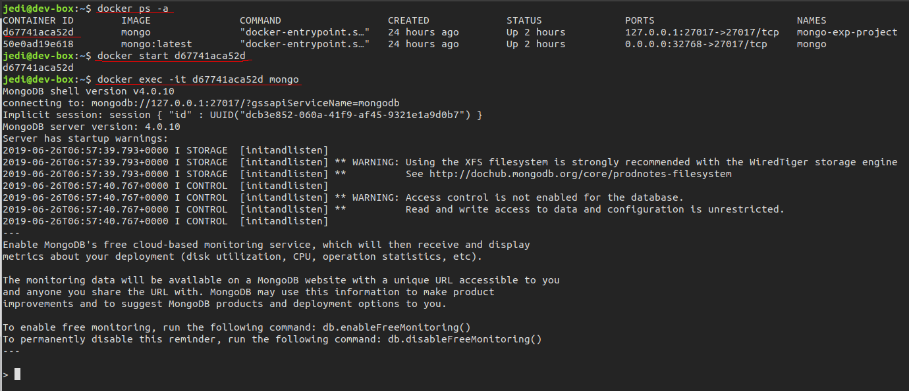

# Описание запуска docker-контейнера с mongo из консоли linux || macOS


## Инициализация (делаем один раз)

Для инициализации запускаем контейнер из официального образа со следующими параметрами:

```bash
$ docker run -d -p 127.0.0.1:27017:27017 --name mongo-exp-project mongo
```

В корне папки `server` есть файл `.env` следующего формата

```ini
DB_HOST=127.0.0.1 - это наш хост из инициализации
DB_NAME=insta
DB_PORT=27017 - это наш порт из инициализации
```
`-d` выполнить детач от текущего терминала и вывести ID контейнера.
`-p` публикует порт контейнера для хоста (это нужно, чтобы сервер mongodb, запущенный внутри контейнера, было видно извне, и к нему можно было подключиться, например, из Node.js).
`--name` просто имя контейнера, чтобы было проще ориентироваться в последствии.
`mongo` — это образ, на основе которого будет запускаться контейнер. В данном случае это наиболее свежий официальный образ mongodb.

## Запуск контейнера

Допустим, наш контейнер оказался остановлен. Это могло произойти, например, из-за банальной перезагрузки операционной системы.

Для начала, выясним ID нашего контейнера:

```bash
$ docker ps -a
```


Ключ -a позволяет нам увидеть весь список контейнеров, в том числе и остановленных. Затем просто запускаем наш контейнер при помощи start, указав ID:

```bash
$ docker start d67741aca52d
```

## Запуск команды внутри контейнера

Иногда бывает нужно что-то сделать в рамках контейнера, выполнить какую-то операцию или, к примеру, запустить оболочку mongodb. Это можно сделать при помощи команды exec.

```bash
$ docker exec -it d67741aca52d mongo
```
`-i` интерактивный режим, оставляет STDIN открытым, таким образом, контейнер остаётся доступным на получение данных.
`-t` выделяет псевдо-TTY (иными словами, некий инстанс текстового терминала).
Ключи `-i` и `-t` выглядят несколько непонятными, не находите? Вообще, если говорить человеческим языком, оба эти ключа позволяют обеспечить интерактивность оболочки mongo. То есть, мы можем писать в ней команды, а она, соответственно, может отдавать нам результат.



Теперь мы подключены к `mongo`.
